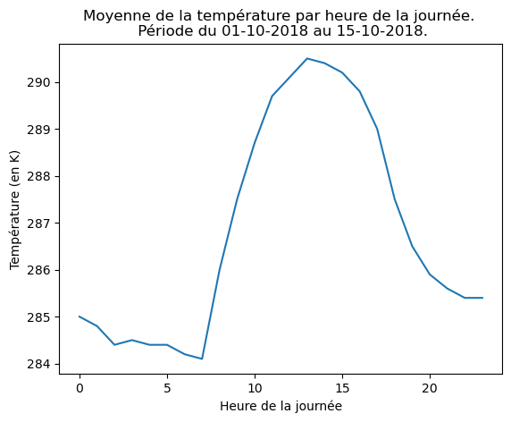

---

marp: true
paginate: true
math: latex 


style: |
  .same_columns {
    display: grid;
    grid-template-columns: repeat(2, minmax(0, 1fr));
    gap: 1rem;
  }
   .columns {
    display: grid;
    grid-template-columns: 2fr 1fr; 
    gap: 1rem;
  }


---
<style>
section {
  padding-top: 0%;
  padding-bottom: 0%;
  padding-left:3%;
}
</style>

# **TP : La station météo**

---
# **Le jeu de données** 
Dans ce TP nous allons commencer à manipuler des données d'observation du réseau de station de MétéoFrance. 
Le jeu de données utilisé pour ce TP est une sous-partie du jeu de données Meteonet https://meteofrance.github.io/meteonet/french/accueil/
Il s'agit d'un an de données observées (au pas de temps horaire) sur certaines stations du Nord Ouest de la France. 


Vous trouverez ce jeu de données sous : 
`/home/newton/ienm2021/chabotv/COURS_CS/data/station_2018.csv`
Inutile de le copier chez vous, vous pouvez directement l'utiliser dans vos scripts python. 

---
# **But du TP** 

Dans ce TP on va voir comment extraire de l'information du fichier csv via l'implémentation de différentes fonctions. 

Nous allons notamment voir :
- Comment lire un fichier csv (via Pandas)
- Comment manipuler des dates


Pour ce TP il vous faudra installer pandas et matplotlib.
1. Activer l'environnement virtuel créé lors du dernier TP.
2. Faire ensuite
  ```sh
  pip install pandas matplotlib 
  ```
---
# **Lecture et ouverture du fichier**

Pour lire et manipuler ce fichier, nous allons utiliser la librairie Pandas. 

```python
import pandas as pd 
# Lecture du fichier
file_path = "/home/newton/ienm2021/chabotv/COURS_CS/data/station_2018.csv"
df = pd.read_csv(file_path,parse_dates=[4])
# Affichage des premières lignes du fichier
print(df.head())
```

L'identifiant de chaque station est donné par la colonne `number_sta`. 
Le fichier csv contient 12 colonnes : 
`['number_sta', 'lat', 'lon', 'height_sta', 'date', 'dd','ff', 'precip', 'hu', 'td', 't', 'psl']`


---
# **Accéder aux identifiants d'une station** 

Le dataFrame marche dans un certain sens comme un dictionnaire. 
Pour accéder à une colonne, on va utiliser une des 12 clés disponibles 
```python 
# Affichage des stations 
print(df["number_sta"])
# Affichage de tous les identifiants
print(df["number_sta"].unique())
```

Explications : 
- `df["number_sta"]` permet d'accéder à tous les éléments de la colonne `number_sta` 
- `.unique()` permet de ne retourner toutes les valeurs qui existent une unique fois. 

---
# **Exercice**

Combien existe-t-il d'identifiant stations dans ce fichier ? 

---

La réponse peut être donnée en utilisant `len` (qui retourne le nombre d'éléments)
```python 
len(df["number_sta"].unique())
```
ou une métohde propre à un objet numpy permettant d'accéder à sa taille 
```python 
df["number_sta"].unique().size
```
ou par `shape` permettant de donner les dimensions d'un objet numpy 
```python 
df["number_sta"].unique().shape
```

**Question :** Comparer le résultat retourné par `df.shape` et `df.size`. 

---
# **Lire et sélectionner les éléments d'une station** 

On va commencer par créer une fonctionnalité permettant de retourner l'ensemble des éléments d'une station. Pour cela, on va filtrer la `Dataframe`.

```python 
def read_station_data(id_number): 
    df =  pd.read_csv(file_path,parse_dates=[4])
    # Verification que l'id existe 
    if id_number not in df["number_sta"].unique(): 
        print(f"La station demandée {id_number} n'existe pas.")
        print(f"Les possibilitées sont {df["number_sta"].unique()}")
        raise ValueError("Station {id_number} does not exist!")
    # Lecture et filtrage 
    return df[df["number_sta"] == id_number]
```

- `df["number_sta"] == id_number` permet de savoir si l'élément est associé à la station `id_number`. Cela créé un tableau de booléens. 
- `df[df["number_sta"] == id_number]` retourne uniquement les lignes du fichier csv associé à la station `id_number`.

---
# **Amélioration du code précédent**

Que se passe-t-il si on veut les données de plusieurs stations ? 
Comment y remédier ? 

---

Que se passe-t-il si on veut les données de plusieurs stations ?  
> Le fichier contenant les données est lu plusieurs fois. Pour des fichiers volumineux, 
> cela peut impacter grandement les performances de votre code. 

Comment y remédier ? 
> On peut lire une fois le fichier en dehors de la fonction, puis le passer en argument. 


```python 
def read_station_data(df:pd.DataFrame, id_number:int)->pd.DataFrame:
  """
    df (pd.DataFrame) : Le dataframe contenant les données 
    id_number (int): Le numéro de station 
  """ 
  # Verification que l'id existe 
  if id_number not in df["number_sta"].unique(): 
      print(f"La station demandée {id_number} n'existe pas.")
      print(f"Les possibilitées sont {df["number_sta"].unique()}")
      raise ValueError("Station {id_number} does not exist!")
  # Filtrage 
  return df[df["number_sta"] == id_number]
```

---
# **Exercice** 

Faite une fonction qui affiche les informations propres à la station à savoir : 
  - latitude 
  - longitude 
  - altitude, 
  

---
# **Une réponse possible**

```python 
def print_station_info(df:pd.DataFrame, id_number:int):
    data = read_station_data(df, id_number)
    print(f" Information pour la station {id_number}")
    print(f" Latitude de la station : {data["lat"].unique()}")
    print(f" Longitude de la station : {data["lon"].unique()}")
    print(f" Hauteur de la station : {data["height_sta"].unique()}")
```

Votre station a-t-elle bougée dans l'année ? 

---

# **Question**

Dans le code suivant, que signifie d'après vous l'arguments `parse_dates=[4]`  ? 
 ```python
df = pd.read_csv(file_path,parse_dates=[4])
 ```


Pour rappel, les colonnes du fichiers sont : 
`['number_sta', 'lat', 'lon', 'height_sta', 'date', 'dd','ff', 'precip', 'hu', 'td', 't', 'psl']`


---
# **Les dates (Apparté)**

Les dates sont des données très particulière. En python, il existe plusieurs classe permettant de les gérer. La plus classique est la classe `datetime`. 

```python 
import datetime as dt 
start_class = dt.datetime(2025,10,14,8,30)
end_class = start_class + dt.timedelta(minutes=115)
print(f" Le cours débute à {start_class} et termine à {end_class}")
```

**Explications :** 
    - `dt.datetime(2025,10,14,8,30)` : On passe l'année, le mois, le jour, l'heure, les minutes ... 
    - `dt.timedelta` : Permet d'ajouter ou de retrancher des jours/heures/minutes à une date. 

---
# **Les dates (Apparté)** 

Il est aussi possible d'accéder directement à différents attributs de la date (par exemple l'heure, le jour de la semaine, ... ). 
Pour cela il suffit de faire : 
`start_class.hour` 

**Attention** : La gestion des dates est la plupart du temps une étape complexe. Bien que `datetime` nous simplifie la vie, cela peut rester complexe.  

---
# **Filtrer une période**

Pour filtrer une période de notre dataFrame, nous allons utiliser les propriétés de la date. 

```python 
# Lecture (dans df déjà chargé) des données de la station 
df_station = read_station_data(df, id_number=22219003)
# Définition du début et fin de période pour le filtrage
start_period = dt.datetime(2018,10,1)
end_period = dt.datetime(2018,10,15)
# Recherche des dates satisfaisant les deux conditions 
selected = (df_station.date > start_period)*(df_station.date < end_period)
# Selection de la bonne période 
df_period = df_station[selected]
# Affichage de la dataframe pour les dates sélectionnées
print(df_period)
```

---
# **Exercice** 

Créer une fonction `select_period` permettant de selectionner une sous période d'un dataframe. Ajouter un argument optionnel permettant de selectionner une heure précise de la journée au sein de cette période.  


---- 
# **Réponse** 

```python 
def select_period(df, start_period, end_period, hour=None): 
    
    # On reprend l'exemple de la slide précédente
    cdt = (df.date > start_period)*(df.date < end_period)
    # Mise a jour de la condition pour rajouter la selection de l'heure
    if hour is not None: # Attention `if hour:` ne fonctionne pas avec 0.  
        cdt = cdt * (df.date.dt.hour == hour)
    df_period = df[cdt]

    return df_period 
```

---
# **Exercice** 

Pour cet exercice, nous allons étudier la période allant du 1er Octobre au 15 Octobre pour la station 22219003.


A quelle(s) date(s) la température maximum a-t-elle été atteinte sur la période ?
Cela correspond-il au moment de la journée pour lequel en moyenne la température est maximale sur la période ?  

**NB** : La température est stockée dans la colonne de la dataframe dénotée `t`. 

*Bonus* : Refaire la même chose en arrondissant la moyenne des températures à la valeur entière la plus proche. Trouvez-vous la/les même heure ? 
Si non, avez vous une idée du problème ?  

---
# **Une solution**

```python 
df_station = read_station_data(df, id_number=22219003)
start_period = dt.datetime(2018,10,1) 
end_period = dt.datetime(2018,10,15)
df_period = select_period(df_station, start_period, end_period)
max_temperature = df_period["t"].max()

# Liste des elements ayant atteint cette température maximum. 
elt = df_period[df_period["t"] == max_temperature]

print(f"La température maximale sur la période a été de {max_temperature}.")
print(f"Elle a été atteinte pour les dates suivantes : {elt["date"].dt.strftime("%Y%m%d-%H").values}")
# On va maintenant trouver la moyenne horaire maximale
# Dictionnaire qui va contenir le maximum pour chaque heure 
mean_hour = {
  "hour": [],
  "value": []
}
# On calcul la moyenne pour chaque heure 
for i in range(0,24): 
    df_period = select_period(df_station, start_period, end_period, hour=i)
    print(len(df_period))
    mean_hour["hour"].append(i) 
    mean_hour["value"].append(df_period["t"].mean())
# On recherche le maximum 
mean_max = np.max(mean_hour["value"])
# On regarde quand ce maximum a été atteint 
index_max = mean_hour["value"].index(mean_max)
# On regarde ensuite l'heure de ce maximum
print(f"L'heure pour laquelle ce maximum a été atteint est {mean_hour['hour'][index_max]} H")
```

---
# **Bonus** 

Le problème de la solution précédente vient de l'utilisation d'`index`. 
Cette méthode renvoit la première occurence de la valeur cherchée de la liste. 
Il faudrait faire une  boucle explicite recherchant la valeur pour avoir toutes les heures correspondant. 

---
# **Exercices** 
<div class="columns">
<div>

- Ecrire une fonction prenant en entrée un dataframe,  la variable d'intérêt (`t`,`hu`, `td`, ...) et retournant l'heure du premier maximum et du premier minimum sur la période. 
- Ecrire une fonction prenant en entrée un dataframe, la variable d'intérêt (`t`, `hu`, `td`, ...), la fonction d'aggrégation (`mean`, `max`, `min`) et retournant la valeur aggrégé par heure de la journée 
- Ecrire une fonction permettant de visualiser la moyenne horaire sur la période  

</div>
<div>



</div>

---
# Une solution Extrema 

```python 
def extrema(df:pd.DataFrame, variable:str):
    """
    Regarde pour une variable donnée la première heure pour 
    laquelle le maximum/minimum a été atteint. 
    """
    maxi = df[variable].max()
    mini = df[variable].min()
    # Filtre pour ne garder que les elements correspondants au maximum
    max_date =  df[df[variable] == maxi]
    # au minimum 
    min_date =   df[df[variable] == mini]
    heure_max = max_date["date"].dt.strftime("%H").values[0]
    heure_min = min_date["date"].dt.strftime("%H").values[0]
    return (heure_max, heure_min )
```

---
# Une solution pour l'aggrégation 

```python 
def aggregation(df:pd.DataFrame,variable:str, methode:str):
    # Création d'une liste pour mettre la donnée aggrégée 
    result = []
    for hour in range(0,24): 
        cdt = df.date.dt.hour == hour 
        df_selected = df[cdt]
        if methode == "mean": 
            result.append(df_selected[variable].mean())
        elif methode == "min": 
            result.append(df_selected[variable].min())
        elif methode == "max": 
            result.append(df_selected[variable].max())
        else:
            raise ValueError("Aggregation method not known")
    return result 
```

---
# Autre solution pour l'aggrégation 
```python 
  def aggregated_bis(df, variable,methode): 
    result = []
    for hour in range(0,24): 
        cdt = df.date.dt.hour == hour 
        df_selected = df[cdt]
        if methode in ["mean","max","min"]:
          # On utilise getattr afin de requeter l'attribut correspondant à notre 
          # méthode et on l'applique 
            result.append(df_selected[variable].__getattr__(methode)())
        else: 
            raise ValueError("Aggregation method not known")
```

Cette solution est plus complexe à lire. Cependant, elle est plus facilement extensible à d'autres fonctionnalités que possède notre objet. On peut à l'aide de la fonction `dir` avoir une idée des principales fonctionnalités de notre objet. 

**Exemple** 
```python 
dir(df["t"])
```

---


#  **Résumé**
Nous disposons maintenant : 
- d'une fonction permettant d'extraire les données correspondant à une station d'un dataFrame
- d'une fonction permettant de filtrer une période particulière du jeu de données
- d'une fonction permettant d'extraire l'heure du maximum et du minimum pour une variable 
- d'une fonction permettant d'aggréger les données d'une période par heure de la journée
- d'une fonction de visualisation du cycle journalier  

Nous verrons lors du prochain cours comment nous pouvons nous en servir pour créer un "objet" station. 