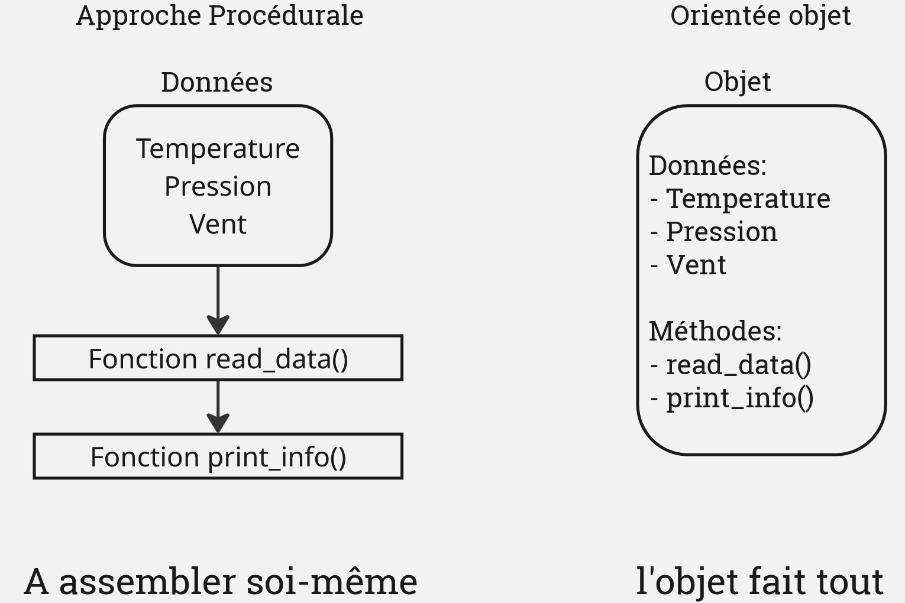

# **La Programmation Orientée Objet**

---
## **Un peu de contexte**

Dans le développement logiciel scientifique, beaucoup de programmeurs n’ont pas une formation poussée en informatique. Ils sont surtout experts en modélisation physique, méthodes numériques, maths appliquées et optimisation des performances.
Du coup, ils utilisent souvent une approche procédurale, qu’ils connaissent bien.

Mais dès qu’on parle de programmation orientée objet, les questions arrivent :

- Faut-il vraiment utiliser des objets ?
- Quels avantages par rapport au procédural ?
- Comment les mettre en place efficacement ?
- Quels sont les pièges à éviter ?

Et comme souvent… la réponse dépend du contexte : il n’y a pas de solution unique.

---
# Procédurale vs Orientée objet


---

Lors du précédent TP nous avons défini plusieurs fonctions pour venir lire, filtrer et interpréter les données d'un fichier CSV relatif à un réseau de stations météo.

*read_station_data()* -> lecture du fichier d'entrée et selection d'une station via son ID
*print_station_info()* -> afficher des informations relatives à cette station
*select_period()* -> sélectionner une plage temporelle sur les données de la station.
*extrema()* -> calculer pour une variable donnée la premiere heure de ses extrema.
*aggregation()* -> calculer pour une variable donnée la moyenne sur chaque heure de la journée.
*visualize()* -> visualiser des données/résultats via un graphique.

---
**Références pour les fonctions:**

```python
def read_station_data(id_number):
    file_path = '/home/newton/ienm2021/chabotv/COURS_CS/data/station_2018.csv' 
    df =  pd.read_csv(file_path,parse_dates=[4])
    # Verification que l'id existe 
    if id_number not in df["number_sta"].unique(): 
        print(f"La station demandée {id_number} n'existe pas.")
        print(f"Les possibilitées sont {df["number_sta"].unique()}")
        raise ValueError("Station {id_number} does not exist!")
    # Lecture et filtrage 
    return df[df["number_sta"] == id_number]

def print_station_info(df:pd.DataFrame):
    print(f" Information pour la station {id_number}")
    print(f" Latitude de la station : {data["lat"].unique()}")
    print(f" Longitude de la station : {data["lon"].unique()}")
    print(f" Hauteur de la station : {data["height_sta"].unique()}")

def select_period(df, start_period, end_period, hour=None): 
    # On reprend l'exemple de la slide précédente
    cdt = (df.date > start_period)*(df.date < end_period)
    # Mise a jour de la condition pour rajouter la selection de l'heure
    if hour is not None: # Attention `if hour:` ne fonctionne pas avec 0.  
        cdt = cdt * (df.date.dt.hour == hour)
    df_period = df[cdt]
    return df_period 

def extrema(df:pd.DataFrame, variable:str):
    """
    Regarde pour une variable donnée la première heure pour 
    laquelle le maximum/minimum a été atteint. 
    """
    maxi = df[variable].max()
    mini = df[variable].min()
    # Filtre pour ne garder que les elements correspondants au maximum
    max_date =  df[df[variable] == maxi]
    # au minimum 
    min_date =   df[df[variable] == mini]
    heure_max = max_date["date"].dt.strftime("%H").values[0]
    heure_min = min_date["date"].dt.strftime("%H").values[0]
    return (heure_max, heure_min )
def aggregation(df:pd.DataFrame,variable:str, methode:str="mean"):
    # Création d'une liste pour mettre la donnée aggrégée 
    result = []
    for hour in range(0,24): 
        cdt = df.date.dt.hour == hour 
        df_selected = df[cdt]
        if methode == "mean": 
            result.append(df_selected[variable].mean())
        elif methode == "min": 
            result.append(df_selected[variable].min())
        elif methode == "max": 
            result.append(df_selected[variable].max())
        else:
            raise ValueError("Aggregation method not known")
    return result 

def visualize(x_value,y_value,axis_labels=['X','Y']):
    """Plot the y vs x values on a graph with the possibility of specified axis labels
    """
    plt.plot(x_value,y_value)
    plt.xlabel(axis_labels[0])
    plt.ylabel(axis_labels[1])
    plt.show()
```

---
### Comment un objet peut apparaître

Les objets sont des outils utiles pour simplifier l'interface de programmation (API). 
Prenons notre script principal, notre API, qui ressemble pour l'instant au suivant:

```python
# Script d'appel pour la station 73010
station_id = 73010
df_station_73010 = read_station_data(station_id)
print_station_info(df_station_73010, station_id)
df_station_73010_oct = select_period(df_station_73010, '2018-10-1', '2018-10-15')
h_temp_max, h_temp_min = extrema(df_station_73010_oct, "t")
mean_temp = aggregation(df_station_73010_oct, "t", methode = "mean")
visualize(range(len(mean_temp)),mean_temp,axis_labels=['Heure de la journée','Temperature Moyenne'])
```
Quels sont les défauts d'un tel script ?


---
```python
# Script d'appel pour la station 73010
station_id = 73010
df_station_73010 = read_station_data(station_id)
print_station_info(df_station_73010, station_id)
df_station_73010_oct = select_period(df_station_73010, '2018-10-1', '2018-10-15')
h_temp_max, h_temp_min = extrema(df_station_73010_oct, "t")
mean_temp = aggregation(df_station_73010_oct, "t", methode = "mean")
visualize(range(len(mean_temp)),mean_temp,axis_labels=['Heure','Temperature Moyenne'])
```
- Répétition des arguments (id, df) à chaque appel.

- Pas de lien entre les fonctions → risque d’erreur et incohérence.

- Aucun état conservé → il faut tout repasser à chaque fois.

- Évolution difficile → une modification touche plusieurs fonctions.

- Code peu réutilisable → compliqué à étendre à plusieurs stations/periodes


---
L'API idéale pourrait ressembler à cela:

```python
Station_73 = StationMeteo(id= 73010)
Station_73.set_period('2018-10-1', '2018-10-15')
h_max,h_min = Station_73.extrema("t")
mean_T = Station_73.aggregat('t',methode='mean')
visualize(range(24), mean_T, axis_labels = ["Heure", "Température moyenne"])
```

- `Station_73` est un *objet* `StationMeteo()` défini pour la station 73010. 
- Cela s'appelle une *instance* de l'objet `StationMeteo`. 
- `.set_period()` est une *methode* de l'objet qui remplace la fonction  `select_period()`. 
- Ce qui rend cet objet unique est son *attribut* `id`.

---

Comment creer ce createur d'objet qu'est `StationMeteo()`?
On définit une *classe*:

```python
class StationMeteo:
    def __init__(self, id_number:int):
        self.id = id_number
        self.df = read_station_data(self.id)
        self.df_period = self.df

    def set_period(self, start, end):
        self.df_period = select_period(self.df, start, end)

    def info(self):
        print_station_info(self.df_period, self.id)

    def extrema(self, var: str):
        return extrema(self.df_period, var)

    def aggregate(self, var:str, methode:str):
        return aggregation(self.df_period, var, methode=methode)
```

---

Cette classe possède une methode d'initialisation `__init__()`:
```python
    def __init__(self, id_number):
        self.id = id_number
        self.df = read_station_data(self.id)
        self.df_period = self.df
```
Ainsi que plusieurs méthodes dont:
```python
    def info(self):
        print_station_info(self.df_period, self.id)
```
Les méthodes sont comme des super fonctions qui, lorsqu'elles sont définies dans une classe, peuvent utiliser des attributs comme ici `self.id` qui sont des paramètres spécifiques de l'objet.


---
## Exercice 

- Mettre en place la classe StationMeteo dans le script et executer une procedure d'appel complète avec instanciation d'un objet StationMeteo pour la station 22219003 et la visualisation de la temperature moyenne pour chaque heure sur la periode du 1er au 5 février 2018.

- Même demande pour la temperature maximale sur la période estivale.

- Ajouter la possibilité d'exporter sous forme de .csv les données  de l'objet station, avec l'option de spécifier une période.

---
## Solution potentielle

```python
Station_73 = StationMeteo(22219003)
# Calcul et visu Temperature moyenne 1 au 5 Février
Station_73.set_period("2018-2-1", "2018-2-5")
mean_T = Station_73.aggregate("t", methode="mean")
visualize(range(24), mean_T, axis_labels=["Heure", "Température moyenne"])

#Calcul et visu Temperature maximale periode estivale
Station_73.set_period("2018-6-1", "2018-8-31")
max_T = Station_73.aggregate("t", methode="max")
visualize(range(24), mean_T, axis_labels=["Heure", "Température moyenne"])
```
Methode de la classe StationMeteo pour l'export:
```python
def export(self, period=False):
        if not period:
            self.df.to_csv(f"station_{self.id}.csv")
        else:
            self.df_period.to_csv(f"station_{self.id}.csv")

````
---
## Vers un objet Reseau

Bien que notre objet StationMeteo réponde désormais à nos besoins, traiter simultanément toutes les stations du fichier aboutirait à un code complexe, difficile à maintenir et susceptible d’introduire des erreurs, à l’image de l’approche fonctionnelle utilisée au départ.

---
## Exercice

- Créer un objet/classe ReseauMeteo permettant d'avoir accès à n'importe quelle station. L'utilisation de l'objet StationMeteo est recommandé...

- Mettre en place une méthode permettant d'afficher les informations des différentes stations du réseau.

- Bonus: Ajouter la possibilité de filtrer la période sur tout le réseau
---
```python
class Reseau:
    def __init__(self, file_path:str):
        self.file_path = file_path
        self.stations = {}
        self._load_stations()

    def _load_stations(self):
        df = pd.read_csv(self.file_path, parse_dates=[4])
        for id_number in df["number_sta"].unique():
            self.stations[id_number] = Station(id_number, station_df)

    def get_station(self, id_number:int):
        return self.stations.get(id_number)
    
    def info(self):
        for id in self.stations:
            print(10 * "-")
            self.stations[id].info()

    def set_period(self, start, end):
        for station in self.stations.values():
            station.set_period(start, end)
```


---
On effectue ici ce que l'on appelle une *composition d'objets*: un objet composé d'autres objets.
Cela permet de se retrouver avec l'API suivante:
```python
Res = Reseau(".../station_2018.csv")
Res.info()

Res.set_period("2018-2-1", "2018-2-5")
mean_T_A = Res.get_station(28206001).aggregate("t", methode="mean")
mean_T_B = Res.get_station(85191003).aggregate("t", methode="mean")
visualize(
    range(24),
    abs(np.array(mean_T_A) - np.array(mean_T_B)),
    axis_labels=["Heure", "Température moyenne"],
)
```
---

## Concept d'API progressive

| Nom | Type | Niveau | Situation |
|---|---|---|---|
| `Reseau()`| Composed object | Haut | Exploiter un reseau de stations  |
| `StationMeteo()`| dedicatedObject | Moyen | Exploiter une seule station |
|  `aggregation()`| dedicated function | Bas | Calculer une donnée statistique |
|  `print_station_info()`| atomic function | Très bas | Afficher des infos |
|  `read_data()`| atomic function |Très bas | Lire un fichier csv |
---

Cette API est « progressive » : les nouveaux utilisateurs peuvent l’utiliser à un niveau élevé, tandis que les utilisateurs plus avancés, disposant d’une meilleure compréhension, ont accès à des fonctions de plus bas niveau.
Cette liberté ne nécessite pas de duplication de code. En effet, en relisant le code source, on constate que chaque nouveau niveau est construit par-dessus le précédent.

Ce type d'API progressive est fondamentale dans la programmation orientée objet et en est par conséquent un de ses atouts majeurs.